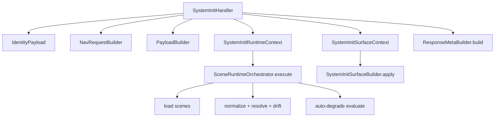

# System Init Runtime Context v1

## Goal
- Keep `system.init` as orchestration shell.
- Centralize runtime state flow in context objects.
- Avoid parameter fan-out growth while preserving behavior.

## Stable Topology

## Runtime Model
- `SystemInitRuntimeContext`:
  - Runtime state for scene loading/normalize/resolve/degrade.
  - Used by `SceneRuntimeOrchestrator.execute(runtime_ctx)`.
- `SystemInitSurfaceContext`:
  - Surface-contract state for governance/capability grouping/role surface.
  - Used by `SystemInitSurfaceBuilder.apply(surface_ctx=...)`.

## Handler Responsibilities
- Prepare bootstrap inputs (identity/nav/intents/preload/payload).
- Build contexts.
- Invoke runtime and surface stages.
- Assemble final meta/etag and return intent envelope.

## Runtime Stages
1. `load`:
   - Load scenes from contract channel, fallback to DB source when needed.
2. `normalize`:
   - Apply structural normalization to scene payload.
3. `resolve`:
   - Resolve scene targets against nav/action maps and evaluate drift.
4. `degrade`:
   - Evaluate auto-degrade policy and reload stable payload if triggered.

## Stability Baseline
- `make verify.system_init.snapshot_equivalence`
  - Determinism for repeated `system.init` user/hud calls.
- `make verify.system_init.runtime_context.stability`
  - RuntimeContext stability for:
    - user mode
    - hud mode
    - hud + critical injected path (`scene_inject_critical_error=1`)

## Guardrail
- Prefer context evolution over adding new execute/apply parameters.
- Avoid adding more micro-builders unless they introduce reusable behavior.
