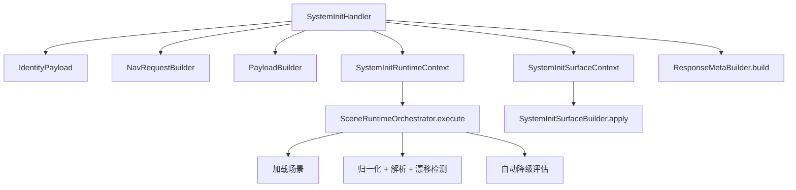

# System Init Runtime Context v1（中文）

## 目标
- 保持 `system.init` 为编排壳层，不承载业务细节。
- 通过上下文对象集中运行时状态。
- 在不改变行为的前提下，抑制参数扩散。

## 稳定拓扑

## 运行时模型
- `SystemInitRuntimeContext`：
  - 承载场景加载/归一化/解析/降级阶段的运行态。
  - 由 `SceneRuntimeOrchestrator.execute(runtime_ctx)` 消费。
- `SystemInitSurfaceContext`：
  - 承载治理输出、能力分组、角色表面等对外契约态。
  - 由 `SystemInitSurfaceBuilder.apply(surface_ctx=...)` 消费。

## Handler 职责
- 准备 identity/nav/intents/preload/payload 输入。
- 构建 runtime/surface 两类上下文。
- 调用运行阶段与表面阶段组件。
- 组装最终 meta/etag 并返回统一 envelope。

## 运行阶段
1. `load`：
   - 从契约通道加载场景；必要时回退到 DB 源。
2. `normalize`：
   - 执行场景结构归一化。
3. `resolve`：
   - 基于 nav/action 进行目标解析，并执行漂移评估。
4. `degrade`：
   - 评估自动降级策略；触发时重载 stable 契约。

## 稳定性基线
- `make verify.system_init.snapshot_equivalence`
  - 校验 user/hud 两种 `system.init` 调用的快照一致性。
- `make verify.system_init.runtime_context.stability`
  - 校验 RuntimeContext 三种路径：
    - user 模式
    - hud 模式
    - hud + critical 注入路径（`scene_inject_critical_error=1`）

## 护栏
- 新能力优先演进上下文对象，而不是继续拉长 `execute/apply` 参数列表。
- 除非产生可复用行为，否则避免新增微型 builder/helper。
