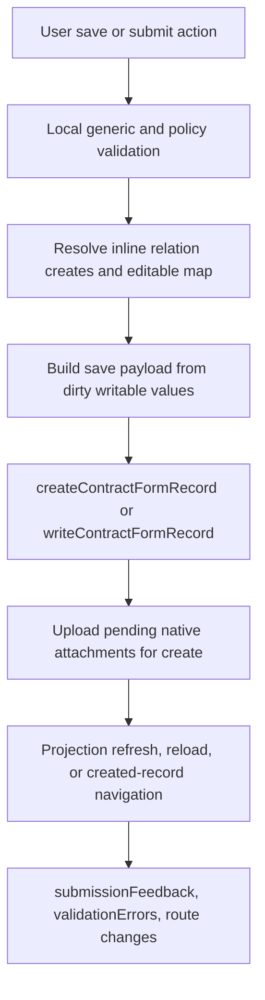
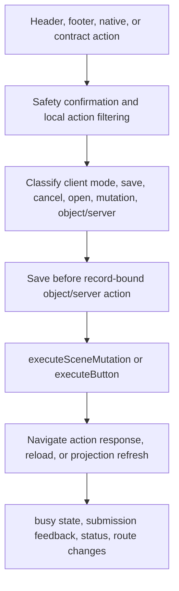
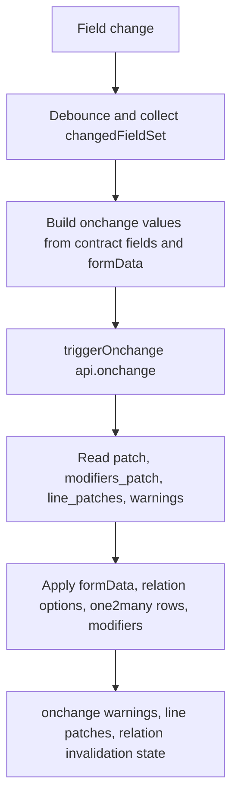

# Contract Form Side Effect Map

Date: 2026-07-13
Branch: `docs/contract-form-side-effect-map`
Baseline: `57b8175f1`

## Scope

This document freezes the current side-effect boundaries for the three main
`ContractFormPage.vue` flows before any further runtime migration.

Do not move these whole flows in the next PR:

- `saveRecord`
- `runAction`
- `runOnchangeRoundtrip`

The next safe work is limited to pure builders, normalizers, tests, and
interface definitions around these flows.

## Save Record



| Item | Current boundary |
| --- | --- |
| Entry point | `ContractFormPage.vue` `saveRecord(refreshPolicy)` |
| Inputs | `canSave`, `model`, `recordId`, `contract`, `formData`, `layoutNodes`, `dirtyFieldSet`, `policyContext`, `one2manyValidation`, pending relation/tag creates, optional `refreshPolicy` |
| Outputs | `false`, `true`, or created record id through `navigateCreatedRecord` |
| Reactive writes | `submissionFeedback`, `validationErrors`, `showOne2manyErrors`, `busyKind`, `dirtyFieldSet`, intake autosave state |
| APIs | `writeContractFormRecord`, `createContractFormRecord`, native attachment upload runtime |
| Loading lifecycle | Sets `busyKind = 'save'` after validation and clears it in `finally`; early no-op edit path clears it before return |
| Error lifecycle | Maps API and validation failures into `validationErrors` and `submissionFeedback`; does not throw to callers |
| Success refresh order | Existing record: write, success feedback, clear dirty fields, projection refresh. New record: create, upload attachments, success feedback, clear autosave, created-record navigation |
| Notification and route effects | Writes inline feedback; create path can navigate through `navigateCreatedRecord`; projection refresh may reload form or app init |
| Shared state | `busyKind`, `dirtyFieldSet`, `originalValues`, `recordVersionToken`, native attachment pending state, scene-ready route state |

Safe pure extractions:

- Save payload builder from `collectRecordSaveValues` inputs and dirty field state.
- Save validation input adapter, excluding reactive writes.
- Create context builder wrapper around `formCreateContextFromState`.
- Save result classifier for write no-op, write success, create success, and failure.

Must stay in page transaction for now:

- `busyKind` ownership.
- Dirty-field clearing after a confirmed write.
- Attachment upload after create.
- Projection refresh and created-record navigation ordering.
- Error feedback writes.

## Run Action



| Item | Current boundary |
| --- | --- |
| Entry point | `useFormActionRuntime().runAction(action)` injected into `ContractFormPage.vue` |
| Inputs | `ContractAction`, current route query, model name, record id, action id, menu id, injected page callbacks |
| Outputs | `Promise<void>`; results are expressed through navigation, refresh, and reactive state |
| Reactive writes | `busyKind`, `errorMessage`, `status`, `submissionFeedback` through injected refs |
| APIs | `executeSceneMutation`, `executeButton`; save path delegates back to page `saveRecord` |
| Loading lifecycle | Sets `busyKind = 'action'` only for mutation and object/server API calls; clears in `finally` |
| Error lifecycle | Mutation failure writes scene-operation error; object/server failure writes execute-button error |
| Success refresh order | Mutation: feedback, projection refresh. Object/server: action-response navigation, explicit refresh result, projection refresh, or reload |
| Notification and route effects | `router.push`, `window.open`, inline feedback, route response navigation |
| Shared state | Shares `busyKind` with save/on-page actions; depends on `saveRecord` transaction before object/server actions |

Safe pure extractions:

- Action classification into `local_mode`, `save`, `cancel`, `open`, `mutation`, `record_button`, `unsupported`.
- Action request parameter builder for `executeButton`.
- Scene mutation input builder.
- Action response refresh decision classifier.

Must stay in page/runtime transaction for now:

- Calling `saveRecord` before record-bound object/server actions.
- Safety confirmation.
- Router navigation and `window.open`.
- `busyKind` lifecycle across API calls.
- Projection refresh and reload ordering.

## Run Onchange Roundtrip



| Item | Current boundary |
| --- | --- |
| Entry point | `scheduleOnchange()` debounce into `runOnchangeRoundtrip()` |
| Inputs | `model`, `recordId`, `changedFieldSet`, `contract.fields`, `formData`, `originalValues`, route query |
| Outputs | No returned value; applies best-effort patches into local state |
| Reactive writes | `changedFieldSet`, `onchangeWarnings`, `onchangeLinePatches`, `onchangeModifiersPatch`, `applyingOnchangePatch`, `formData`, `relationKeywords`, invalidated/cleared relation state |
| APIs | `triggerOnchange` with intent `api.onchange` |
| Loading lifecycle | No global loading state; debounce is silent |
| Error lifecycle | Catch-all best effort; failed onchange keeps current values and does not surface a user error |
| Success refresh order | Apply warnings and line patches metadata; merge modifier patch; query relation options for relational modifier changes; apply field patch; apply one2many line patches |
| Notification and route effects | None directly |
| Shared state | Shares relation option caches, one2many row runtime, field dirty/change tracking, route context |

Safe pure extractions:

- Onchange values builder from field descriptors, form data, original values, and one2many command builder.
- Onchange response normalizer for `patch`, `modifiers_patch`, `line_patches`, and `warnings`.
- Field patch classifier by field type.
- Relation invalidation decision for cleared many2one values.
- One2many line patch normalization before applying row runtime mutations.

Must stay in page transaction for now:

- Debounce timer and `changedFieldSet` ownership.
- `applyingOnchangePatch` guard.
- Direct `formData` writes.
- Relation option cache updates and async relation queries.
- One2many row runtime mutation.
- Silent failure semantics.

## Shared State Coupling

| State | saveRecord | runAction | runOnchangeRoundtrip |
| --- | --- | --- | --- |
| `busyKind` | Owns `save` lifecycle | Owns `action` lifecycle | None |
| `formData` | Reads and may clear autosave after create | Reads through injected save/action context | Writes patches directly |
| `dirtyFieldSet` | Reads, clears after save, controls edit payload | Indirectly through save-before-action | Field changes feed `changedFieldSet`; patch application must not create false dirty state |
| `validationErrors` | Writes validation/API failures | Some action paths write errors through injected refs | No user-facing errors |
| `submissionFeedback` | Writes save/create result | Writes action success/failure | None |
| `router` | Create navigation through created-record runtime | Direct open/cancel/action-response navigation | None |
| `session` | Projection refresh may reload app init | Projection refresh may reload app init | None |
| relation caches | Resolves pending creates before save | Indirect | Reads and writes relation options/keywords |
| one2many rows | Validates and serializes | Indirect | Applies line patches |

## Behavior Regression Matrix

This matrix is the minimum baseline for the post-split ContractForm phase. It
does not authorize moving transaction owners out of the page/runtime; it records
which behavior must stay covered while pure builders and protocol helpers evolve.

| Scenario | Required behavior | Current coverage |
| --- | --- | --- |
| Edit existing record | Save writes dirty editable values, clears dirty state only after confirmed write, then refreshes projection according to policy | `contract_form_save_payload_builder_guard.py`; manual form regression |
| Create record | Create sends normalized values, uploads pending attachments after create, clears autosave state, then navigates through created-record runtime | `contract_form_save_payload_builder_guard.py`; manual form regression |
| Save validation failure | Local and one2many validation return before `busyKind = 'save'`; validation errors remain visible | `contract_form_side_effect_regression_guard.py`; manual form regression |
| Save API failure | API failures clear `busyKind` in `finally` and write user-visible feedback without throwing to callers | `contract_form_side_effect_regression_guard.py`; manual form regression |
| Normal action | Action plan classification stays pure; object/server calls use action busy lifecycle and clear it in `finally` | `contract_form_action_plan_builder_guard.py`; manual form regression |
| Tier or prompt action | Prompt validation failures return before remote execution; object/server failures write status through runtime state protocol | `contract_form_runtime_state_protocol_guard.py`; manual form regression |
| Config save | `formConfig` uses `begin/end` busy events around API work and keeps reload/feedback ordering in the runtime | `contract_form_runtime_state_behavior_guard.sh`; manual form regression |
| Inline field policy | Busy precheck prevents duplicate policy writes; `inlinePolicy` clears busy in `finally` | `contract_form_runtime_state_behavior_guard.sh`; manual form regression |
| Contract mode action | `contractMode` uses shared busy/status events without changing page navigation semantics | `contract_form_runtime_state_behavior_guard.sh`; manual form regression |
| Onchange field patch | Request payload and response patch normalization remain pure; failed onchange is best-effort and silent | `contract_form_onchange_normalization_guard.py`; manual form regression |
| Relation onchange | Relation display/id normalization stays in helper; cache/query side effects stay in page transaction | `contract_form_onchange_normalization_guard.py`; manual form regression |
| Native structures | group, notebook, statusbar, and x2many behavior remain governed by native contract/runtime guards | `frontend_page_contract_boundary_guard.py`; `frontend_page_contract_orchestration_consumption_guard.py`; manual form regression |
| Duplicate click | Existing global busy guard remains the concurrency boundary; no new parallel transaction state is introduced | `contract_form_runtime_state_behavior_guard.sh`; `contract_form_side_effect_regression_guard.py` |
| Network or action error | Busy/status do not remain stuck after failed save/action/config calls | `contract_form_runtime_state_behavior_guard.sh`; `contract_form_side_effect_regression_guard.py`; manual form regression |

Manual form regression means exercising the path in a browser or containerized
acceptance run before a release. The quick gate enforces that each scenario has
an explicit owner and at least one code-level guard where the repository can
verify it without a live Odoo database.

## Interface Candidates

These interfaces can be introduced before moving any transaction owner:

```ts
type SavePayloadBuildInput = {
  recordId: number | null;
  contract: unknown;
  formData: Record<string, unknown>;
  originalValues: Record<string, unknown>;
  editableMap: Record<string, boolean>;
  dirtyFieldNames: string[];
};

type ActionExecutionPlan =
  | { kind: 'local_mode'; mode: string }
  | { kind: 'save'; refreshPolicy?: unknown }
  | { kind: 'cancel' }
  | { kind: 'open_action'; actionId: number }
  | { kind: 'open_url'; url: string; target?: string }
  | { kind: 'scene_mutation'; actionKey: string; params: Record<string, unknown> }
  | { kind: 'record_button'; model: string; recordId: number; methodName: string; buttonType: 'object' | 'server' };

type OnchangeApplyPlan = {
  warnings: unknown[];
  linePatches: unknown[];
  modifierPatch: Record<string, Record<string, unknown>>;
  fieldPatches: Array<{ name: string; fieldType: string; value: unknown }>;
};
```

## Next PR Order

1. Extract save payload builder and tests.
2. Extract action execution-plan builder and tests.
3. Extract onchange input/response normalization and tests.
4. Define shared loading/error protocol.
5. Re-evaluate `useFormSaveRuntime` only after the save payload builder is stable.
6. Move full `saveRecord` last.
7. Keep `runAction` and `runOnchangeRoundtrip` in separate PRs.
